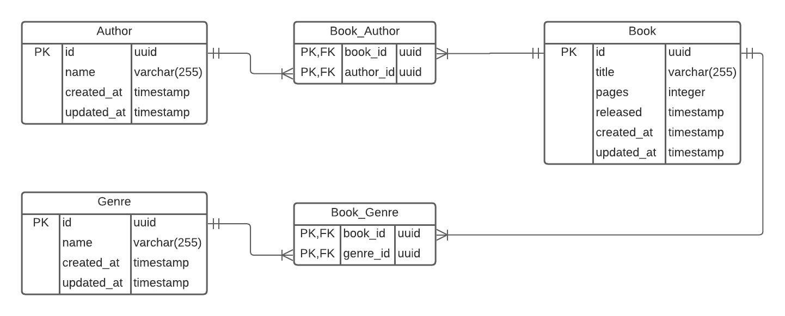

# This is a books crud
I made this simple application to document my learning in docker.

## Technologies used
* Node.js
* TypeScript

## The Entity Relationship Model used

## How to run?
Use the following command in the terminal to start the containers: `docker-compose --env-file .env up -d`